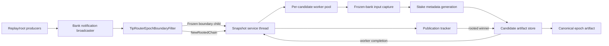

# Jito Tip-Router Snapshot Service

The tip-router snapshot service runs inside `agave-validator`. At each epoch
boundary it derives the stake metadata consumed by the Jito Tip Router NCN from
the final bank of the previous epoch. It may generate candidates for multiple
forks, but it publishes only the candidate whose bank later appears in the
rooted chain.

The service is disabled by default and is intended to run on a non-voting
validator.

## Validator CLI arguments

Pass all of the following arguments in addition to the validator's normal
configuration:

```text
--no-voting
--enable-tip-router-snapshot-service
--tip-router-snapshot-output-dir <PATH>
--tip-router-snapshot-tip-distribution-program-id <PUBKEY>
--tip-router-snapshot-priority-fee-distribution-program-id <PUBKEY>
--tip-router-snapshot-tip-payment-program-id <PUBKEY>
```

For example:

```bash
agave-validator \
  <normal validator arguments> \
  --no-voting \
  --enable-tip-router-snapshot-service \
  --tip-router-snapshot-output-dir /var/lib/jito-tip-router \
  --tip-router-snapshot-tip-distribution-program-id <TIP_DISTRIBUTION_PROGRAM_ID> \
  --tip-router-snapshot-priority-fee-distribution-program-id <PRIORITY_FEE_DISTRIBUTION_PROGRAM_ID> \
  --tip-router-snapshot-tip-payment-program-id <TIP_PAYMENT_PROGRAM_ID>
```

| Argument | Required | Purpose |
| --- | --- | --- |
| `--no-voting` | Yes | Prevents this snapshot validator from voting. The enable flag requires it. |
| `--enable-tip-router-snapshot-service` | Yes | Enables the service. Without this gate, all other tip-router snapshot arguments are rejected. |
| `--tip-router-snapshot-output-dir <PATH>` | Yes | Directory in which candidate and canonical JSON artifacts are written. The service creates it when necessary. |
| `--tip-router-snapshot-tip-distribution-program-id <PUBKEY>` | Yes | Program used to derive and validate each validator's tip-distribution account. |
| `--tip-router-snapshot-priority-fee-distribution-program-id <PUBKEY>` | Yes | Program used to derive and validate each validator's priority-fee distribution account. |
| `--tip-router-snapshot-tip-payment-program-id <PUBKEY>` | Yes | Program used to read the tip-payment configuration and tip-account balances. |

The three program IDs have no defaults. They must be the IDs deployed on the
cluster the validator is following. Every `<PUBKEY>` is validated during CLI
parsing.

## Output artifacts

Candidate files are written without replacing an existing file:

```text
<output-dir>/
├── candidates/
│   └── <slot>_<bank-id>_<epoch>_stake_meta_collection.json
└── <epoch>_stake_meta_collection.json
```

The top-level file is the canonical, rooted artifact. Publication creates the
canonical name with a hard link, so it is atomic and cannot overwrite an
artifact already published for that epoch. After successful publication, the
service removes the candidate files for that epoch. Candidates abandoned when
the service advances to a newer epoch are deliberately left on disk for
diagnosis.

The output is a `StakeMetaCollection`. It contains the bank identity and the
sorted validator/delegation metadata used by tip-router merkle-root generation,
including tip-distribution and priority-fee-distribution metadata when the
corresponding on-chain accounts exist and are valid.

## Architecture



The main boundaries are:

1. **Validator integration.** When configured, `Validator` gives the service an
   independent bank-notification channel and a shared shutdown flag. It does not
   require RPC to be enabled. Producer-side filtering forwards only frozen
   epoch-boundary banks and rooted-chain notifications.
2. **Single-threaded orchestration.** The `tipRtSnapshot` service thread owns the
   publication state machine and multiplexes bank notifications, worker
   completions, and shutdown polling. This serializes state transitions.
3. **Candidate workers.** Each admitted boundary candidate gets a worker thread.
   The candidate is the boundary child's parent: the last observed bank in the
   previous epoch. Candidate identity includes `epoch`, `slot`, and `bank_id`, so
   competing banks at the same slot remain distinct.
4. **Frozen-bank capture.** The worker first verifies that the bank is frozen and
   captures all bank-dependent inputs. Delegations normally come from a
   persistent snapshot of the runtime stakes cache; an AccountsDB scan is the
   fallback when that cache contains no delegations. Expensive aggregation and
   sorting proceed on owned data after the worker releases the bank.
5. **Artifact storage.** Workers write fork-specific JSON under `candidates/`.
   Once rooting identifies the winner, the service atomically publishes it at
   the output directory's top level and cleans up that epoch's candidates.

Relevant implementation entry points are
[`config/cli.rs`](src/config/cli.rs),
[`service/mod.rs`](src/service/mod.rs),
[`service/context.rs`](src/service/context.rs),
[`service/publication_state.rs`](src/service/publication_state.rs), and
[`stake_meta/capture.rs`](src/stake_meta/capture.rs).

## Main state machine

`SnapshotPublicationTracker` is the service's main state machine. It tracks
publication policy only; worker handles and completion delivery are kept in the
separate worker pool.

| State | Meaning | Event and guard | Action / next state |
| --- | --- | --- | --- |
| `AwaitingCandidate` | No epoch-boundary candidates are being tracked. | An eligible frozen boundary child arrives and its worker starts successfully. | Record its parent bank as a candidate; move to `TrackingCandidates`. |
| `TrackingCandidates` | One or more fork candidates for one epoch are known. | A distinct candidate for the same epoch arrives. | Add it and remain in `TrackingCandidates`. |
| `TrackingCandidates` | One or more fork candidates for one epoch are known. | A candidate for a newer epoch arrives. | Abandon the older in-memory set, retain its files, and track the newer candidate set. |
| `TrackingCandidates` | One or more fork candidates for one epoch are known. | A rooted chain contains tracked candidates matching both `slot` and `bank_id`. | Choose the matching candidate with the highest slot; move to `WinnerPendingPublication`. |
| `WinnerPendingPublication` | A rooted winner has been selected and publication is in progress. | Canonical publication succeeds, or the epoch was already published. | Record the latest published epoch; move to `AwaitingCandidate`. |
| `WinnerPendingPublication` | A rooted winner has been selected and publication is in progress. | Publication fails. | Log the failure and move to `AwaitingCandidate` without advancing the published epoch. |

Additional guards reject duplicate candidates, candidates older than the epoch
currently being tracked, candidates at or before the latest published epoch,
and new candidates while publication is in progress. A failed unrooted worker
is removed from the tracked set. Losing the output directory is fatal, as is a
failure attributed to a winner being published; either condition sets the
validator's shared exit flag. During normal shutdown the service waits up to 30
seconds for in-flight candidate workers.

The lifecycle in its compact form is:

```text
AwaitingCandidate
    -- eligible Frozen boundary child --> TrackingCandidates
TrackingCandidates
    -- additional fork candidate ------> TrackingCandidates
    -- rooted winner -------------------> WinnerPendingPublication
WinnerPendingPublication
    -- publish success/already exists --> AwaitingCandidate
    -- publish failure -----------------> AwaitingCandidate
```
