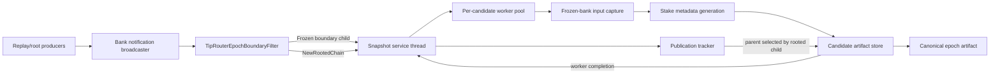

# Jito Tip-Router Snapshot Service

The tip-router snapshot service runs inside `agave-validator`. At each epoch
boundary it derives the stake metadata consumed by the Jito Tip Router NCN from
the final bank of the previous epoch. It calculates candidate snapshots from
the parents of frozen epoch-boundary banks, then publishes a parent's snapshot
only when one of its boundary children appears in the rooted chain and the
snapshot has finished writing.

The service is disabled by default and is intended to run on a non-voting
validator.

## Validator CLI arguments

Pass all of the following arguments in addition to the validator's normal
configuration:

```text
--no-voting
--enable-tip-router-snapshot-service
--tip-router-snapshot-output-dir <PATH>
--tip-router-snapshot-tip-distribution-program-id <PUBKEY>
--tip-router-snapshot-priority-fee-distribution-program-id <PUBKEY>
--tip-router-snapshot-tip-payment-program-id <PUBKEY>
```

For example:

```bash
agave-validator \
  <normal validator arguments> \
  --no-voting \
  --enable-tip-router-snapshot-service \
  --tip-router-snapshot-output-dir /var/lib/jito-tip-router \
  --tip-router-snapshot-tip-distribution-program-id <TIP_DISTRIBUTION_PROGRAM_ID> \
  --tip-router-snapshot-priority-fee-distribution-program-id <PRIORITY_FEE_DISTRIBUTION_PROGRAM_ID> \
  --tip-router-snapshot-tip-payment-program-id <TIP_PAYMENT_PROGRAM_ID>
```

| Argument | Required | Purpose |
| --- | --- | --- |
| `--no-voting` | Yes | Prevents this snapshot validator from voting. The enable flag requires it. |
| `--enable-tip-router-snapshot-service` | Yes | Enables the service. Without this gate, all other tip-router snapshot arguments are rejected. |
| `--tip-router-snapshot-output-dir <PATH>` | Yes | Directory in which candidate and canonical JSON artifacts are written. The service creates it when necessary. |
| `--tip-router-snapshot-tip-distribution-program-id <PUBKEY>` | Yes | Program used to derive and validate each validator's tip-distribution account. |
| `--tip-router-snapshot-priority-fee-distribution-program-id <PUBKEY>` | Yes | Program used to derive and validate each validator's priority-fee distribution account. |
| `--tip-router-snapshot-tip-payment-program-id <PUBKEY>` | Yes | Program used to read the tip-payment configuration and tip-account balances. |

The three program IDs have no defaults. They must be the IDs deployed on the
cluster the validator is following. Every `<PUBKEY>` is validated during CLI
parsing.

## Output artifacts

Candidate files are written without replacing an existing file:

```text
<output-dir>/
├── candidates/
│   └── <slot>_<bank-id>_<epoch>_stake_meta_collection.json
└── <epoch>_stake_meta_collection.json
```

The slot, bank ID, and epoch in each candidate filename identify the **parent**
bank used to calculate the snapshot. Boundary child identities are tracked in
memory for winner selection.

The top-level file is the canonical, rooted artifact. Publication creates the
canonical name with a hard link, so it is atomic and cannot overwrite an
artifact already published for that epoch. After creating the canonical name,
the service removes the candidate files it finds for that epoch. Workers
already in flight may write files after this cleanup. Candidates abandoned
when the service advances to a newer epoch are deliberately left on disk for
diagnosis.

The output is a `StakeMetaCollection`. It contains the bank identity and the
sorted validator/delegation metadata used by tip-router merkle-root generation,
including tip-distribution and priority-fee-distribution metadata when the
corresponding on-chain accounts exist and are valid.

## Architecture


```mermaid
flowchart LR
    P[Replay/root producers] --> B[Bank notification broadcaster]
    B --> F[TipRouterEpochBoundaryFilter]
    F -->|Frozen boundary child| S[Snapshot service thread]
    F -->|NewRootedChain| S
    S --> T[Publication tracker]
    S --> W[Per-candidate worker pool]
    W --> C[Frozen-bank input capture]
    C --> M[Stake metadata generation]
    M --> A[Candidate artifact store]
    A -->|worker completion| S
    T -->|parent selected by rooted child| A
    A --> O[Canonical epoch artifact]
```

The main boundaries are:

1. **Validator integration.** When configured, `Validator` gives the service an
   independent bank-notification channel and a shared shutdown flag. It does not
   require RPC to be enabled. Producer-side filtering forwards only frozen
   epoch-boundary banks and rooted-chain notifications.
2. **Single-threaded orchestration.** The `tipRtSnapshot` service thread owns the
   publication state machine and multiplexes bank notifications, worker
   completions, and shutdown polling. This serializes state transitions.
3. **Candidate workers.** Each newly admitted parent candidate gets a worker
   thread. The parent is the last bank of its epoch on that child's branch.
   Candidate identity includes `epoch`, `slot`, and `bank_id`, so competing
   banks at the same slot remain distinct. Additional boundary children sharing
   a tracked parent reuse its worker or written artifact; each distinct child
   is remembered by `(slot, bank_id)`.
4. **Frozen-bank capture.** The worker first verifies that the bank is frozen and
   captures all bank-dependent inputs. Delegations normally come from a
   persistent snapshot of the runtime stakes cache; an AccountsDB scan is the
   fallback when that cache contains no delegations. Expensive aggregation and
   sorting proceed on owned data after the worker releases the bank.
5. **Artifact storage.** Workers write fork-specific JSON under `candidates/`.
   Once a boundary child roots and its parent's artifact is written, the service
   atomically publishes that artifact at the output directory's top level and
   cleans up that epoch's candidates.

Relevant implementation entry points are
[`config/cli.rs`](src/config/cli.rs),
[`service/mod.rs`](src/service/mod.rs),
[`service/context.rs`](src/service/context.rs),
[`service/publication_state.rs`](src/service/publication_state.rs), and
[`stake_meta/capture.rs`](src/stake_meta/capture.rs).

## Fork selection

A boundary child has a greater epoch than its parent; skipped slots do not
change this rule. The parent supplies the snapshot state, while rooting the
child establishes that its parent was the final bank of that epoch on the
surviving chain.

For example, suppose the next epoch starts at slot 100:

```text
          +--> 100 --> ...          losing branch
... --> 98
          +--> 99 --> 104 --> ...   surviving branch
```

Freezing 100 creates candidate 98; freezing 104 creates candidate 99. Both
parents can root because 98 is an ancestor of 99. Rooting either parent alone
does not select a snapshot. A rooted-chain notification containing child 104
selects parent 99, including when 104 is an ancestor of a later root.

Selection matches the child's slot **and bank ID**. If multiple children share
one parent, any associated child can validate that parent's snapshot. Repeated
notifications for the same child do not create another worker or reset artifact
readiness. The implementation retains a highest-parent-slot selection among
qualifying candidates, but qualification requires a rooted boundary child.

## Main state machine

`SnapshotPublicationTracker` is the service's main state machine. It tracks
publication policy only; worker handles and completion delivery are kept in the
separate worker pool.

| State | Meaning | Event and guard | Action / next state |
| --- | --- | --- | --- |
| `AwaitingCandidate` | No epoch-boundary candidates are being tracked. | An eligible frozen boundary child arrives and its worker starts successfully. | Record its parent and child identity; move to `TrackingCandidates`. |
| `TrackingCandidates` | Parent candidates for one epoch are known. | Another boundary child of a tracked parent arrives. | Remember the child if new; reuse the parent's worker or artifact. |
| `TrackingCandidates` | Parent candidates for one epoch are known. | A distinct parent candidate for the same epoch arrives and its worker starts. | Add the parent and child identity; remain in `TrackingCandidates`. |
| `TrackingCandidates` | Parent candidates for one epoch are known. | A candidate for a newer epoch arrives and its worker starts. | Abandon the older in-memory set, retain its files, and track the newer candidate. |
| `TrackingCandidates` | No boundary child has yet selected a winner. | A candidate's artifact finishes writing. | Mark it written; continue waiting for a qualifying rooted child. |
| `TrackingCandidates` | Parent candidates for one epoch are known. | A rooted chain contains an associated boundary child matching both `slot` and `bank_id`. | Select its parent; move to `WinnerPendingPublication`. Publish immediately if written, otherwise await its worker. |
| `WinnerPendingPublication` | A parent has been selected through a rooted boundary child. | Its unfinished artifact completes. | Publish the selected parent's artifact. |
| `WinnerPendingPublication` | A parent has been selected through a rooted boundary child. | Canonical publication succeeds, or the epoch was already published. | Record the latest published epoch; move to `AwaitingCandidate`. |
| `WinnerPendingPublication` | A parent has been selected through a rooted boundary child. | Publication fails. | Log the failure and move to `AwaitingCandidate` without advancing the published epoch. |

Additional guards reject candidates older than the epoch currently being
tracked, candidates at or before the latest published epoch, and new candidates
while publication is pending. Selecting a winner discards the other candidates from tracking, but
their workers may still complete.

The lifecycle in its compact form is:

```text
AwaitingCandidate
    -- eligible Frozen boundary child --> TrackingCandidates
TrackingCandidates
    -- additional parent or child ------> TrackingCandidates
    -- associated boundary child roots -> WinnerPendingPublication
WinnerPendingPublication
    -- winner's worker finishes --------> publish artifact
    -- publish success/already exists --> AwaitingCandidate
    -- publish failure -----------------> AwaitingCandidate
```
